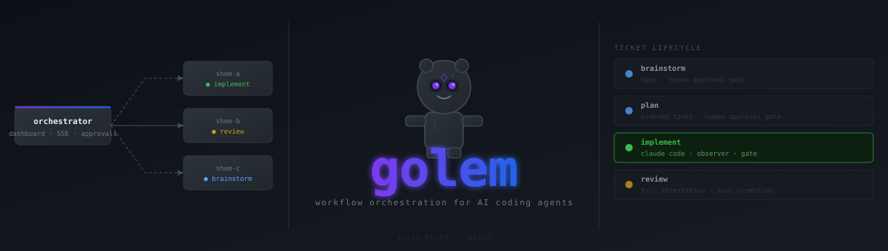

<div align="center">
  
</div>

<div align="center">

[](https://go.dev)
[](#backends)

</div>

---

Golem is a workflow layer for AI coding agents. It gives your LLM the same process a good engineering team uses: a ticket lifecycle, distinct roles that check each other's work, a searchable wiki that grows with the project, and a code graph so agents navigate without reading every file.

Two modes, one tool:

- **CLI** — run Golem locally, one developer, one repo. Full lifecycle from your terminal.
- **Orchestrator + Shem** — distributed mode. A central web UI manages tickets; autonomous worker nodes (shems) claim and execute them in parallel, streaming progress back to the dashboard.

## Why Golem

LLM agents left to their own devices are fast but sloppy. They skip specs, invent abstractions, miss conventions, and forget everything between sessions. Golem doesn't try to make the model smarter — it gives it structure.

Every change starts as a ticket. The ticket goes through **brainstorm → plan → implement → review → close**. At each step, a different role runs: a developer to write code, a convention-enforcer to check patterns, a spec-adherence checker to keep scope honest, a reviewer to attest the whole thing. Humans approve transitions between phases, staying in control without doing the work.

The **code graph** (`golem graph build`) indexes every module so agents find the right file without scanning everything. On a 50-file repo it cuts orientation token usage by ~50%; on larger repos it's closer to 80%.

---

## CLI Mode

### Install

```sh
go install github.com/leonp92/golem/cmd/golem@latest
```

### Quick Start

```sh
# 1. Initialise Golem in your repo
golem init --backend claude-code

# 2. Build the code graph (optional but recommended for larger repos)
golem graph build

# 3. Open a ticket
golem ticket new "Add rate limiting to the auth middleware"

# 4. Work through the lifecycle
golem ticket advance --to plan
golem ticket advance --to implement
golem ticket review
golem ticket close
```

### How It Works

#### Tickets

Every piece of work is a ticket. Golem creates a dedicated git worktree and branch (`ticket/<id>`) so work is isolated from main and from other in-flight tickets.

```
.golem/tickets/<id>/
  state.json   ← phase, branch, worktree path
  log.jsonl    ← append-only blackboard: every finding, blocker, resolution
```

#### Roles

Four roles ship by default. Each is a markdown prompt in `.golem/roles/` — owned by your repo and editable after `init`.

| Role | When it runs | What it checks |
|---|---|---|
| `developer` | During implement | Writes code following YAGNI/KISS identity |
| `convention-enforcer` | After every commit | Naming, structure, project patterns |
| `spec-adherence` | After every commit | Scope creep, plan alignment |
| `reviewer` | At `ticket review` | Full attestation across all categories |

#### Observer

The observer dispatches watcher roles after commits. You call it manually, keeping control of when checks fire:

```sh
golem observer dispatch --ticket <id> --role convention-enforcer --commit $(git rev-parse HEAD)
golem observer dispatch --ticket <id> --role spec-adherence     --commit $(git rev-parse HEAD)
```

Each dispatch is fire-and-forget: the role reads the diff and ticket log, writes findings to the blackboard. Multiple dispatches run in parallel.

#### Gate

Before `ticket review` is allowed, Golem runs the commands in your `gate.commands` config. If any command fails, review is blocked.

```yaml
gate:
  commands:
    - make build
    - make test
```

#### Code Graph

```sh
golem graph build              # full index of the entire repo
golem graph update             # incremental — only changed modules since last build
golem graph status             # show what's stale
```

The graph-builder agent analyses each module and writes structured summaries — exports, types, imports, subsystem — into `.golem/wiki/graph/`, included in wiki search. Language-agnostic.

#### Wiki

`.golem/wiki/` is a markdown knowledge base committed to your repo. Agents search it before writing code to avoid reinventing what already exists. Search is TF-IDF with co-mention link expansion — zero API calls:

```sh
golem wiki search "rate limiting"
```

#### Soul

When a human resolves a ticket differently from what a role recommended, Golem notices. At `ticket close`, the reviewer generalises the divergence into a durable heuristic and promotes it to `.golem/wiki/soul/`. Future agents find it via wiki search and apply it automatically.

### Using with Claude Code

`golem init --backend claude-code` generates subagent definitions in `.claude/agents/` and two slash commands:

- `/golem:new-ticket` — walks the full ticket lifecycle interactively from inside Claude Code.
- `/golem:tickets` — lists active tickets and their current phase.

### Configuration

`.golem/config.yaml` is created by `golem init` and committed to your repo:

```yaml
backend: claude-code

gate:
  commands:
    - make build
    - make test

graph:
  ignore_patterns:
    - "migrations/**"
  max_file_size_kb: 200
  extra_extensions:
    - ".graphql"
    - ".proto"

role_models:
  reviewer: claude-opus-4-7
```

### Commands

```
golem init --backend <name>                    initialise .golem in a repo

golem ticket new "<description>"               create ticket, worktree, branch
golem ticket advance --to <phase>
golem ticket set-step --expected-lines <n>
golem ticket review
golem ticket close
golem ticket resume
golem tickets                                  list all active tickets

golem graph build   [--concurrency N]          full graph rebuild
golem graph update  [--concurrency N]          incremental update
golem graph status                             show stale modules

golem wiki search "<query>"
golem wiki rebuild

golem observer dispatch --ticket <id> --role <role> --commit <sha>
golem log emit --ticket <id> --role <role> --type <type> <message>
```

---

## Orchestrator + Shem (Distributed Mode)

The orchestrator adds a team-scale coordination layer on top of the CLI. Instead of running tickets manually, you create them in a web UI and autonomous **shem** worker nodes execute them in parallel.

```
Browser ──► Orchestrator (dashboard, approval gates)
                │
      ┌─────────┴──────────┬──────────┐
   Shem-A               Shem-B     Shem-C
  (worker)             (worker)   (worker)
   repo A               repo A     repo B
```

**Benefits over CLI mode:**

- **Parallel execution** — multiple tickets run simultaneously across one or more shems. Work doesn't queue behind a single terminal session.
- **Human approval gates** — brainstorm and plan phases pause for review in the UI before the shem continues. You see the spec and plan before any code is written.
- **Real-time visibility** — the blackboard log streams to the dashboard as the shem works. Blockers and findings surface immediately.
- **Atomic ticket claiming** — multiple shems on the same repo claim tickets without races. No duplicated work.
- **Horizontal scaling** — add more shem nodes to increase parallelism. Each shem is stateless; the orchestrator holds all state in SQLite.

### Quick Start (Docker Compose)

```sh
# Clone the repo, then:
./run.sh
```

On first run the script creates `.env` from the example and exits — fill in `ANTHROPIC_API_KEY` and `GOLEM_ADMIN_PASSWORD`, then run it again. It auto-generates a shem API key and starts the stack. Open `http://localhost:8080` when it's done.

Create a ticket from the UI. The shem will pick it up within seconds, run brainstorm, and pause for your approval before proceeding to plan and implementation.

### How It Works

1. You create a ticket in the UI with a description and target repo.
2. A shem claims it atomically via the REST API.
3. The shem runs `golem ticket new` to scaffold the worktree, then invokes Claude Code for the brainstorm phase.
4. The shem posts the spec to the orchestrator and waits for human approval.
5. On approval, the shem runs the plan phase — same gate, same wait.
6. On approval, the shem implements and reviews. When done, the ticket enters `ready-for-review`.
7. You close the ticket from the UI.

At every step the shem tails the ticket's `log.jsonl` and forwards entries to the orchestrator over HTTP, which fans them out to the browser via SSE.

### Shem Configuration

```yaml
# shem.yaml
orchestrator: http://localhost:8080
name: my-shem
# api_key: set via GOLEM_SHEM_API_KEY env var

no_push: true   # for local testing; remove in production

repos:
  - path: /path/to/local/repo
    remote: https://github.com/your-org/your-repo
```

### Running Multiple Shems

Each shem is a stateless binary. To scale:

```sh
# On additional machines or containers, point at the same orchestrator
GOLEM_SHEM_API_KEY=<key> golem-shem --config shem.yaml
```

Register each shem with a unique name:

```sh
golem-orchestrator shems add --name shem-2
```

### Running Without Docker

```sh
# Orchestrator
go build -o golem-orchestrator ./cmd/orchestrator
./golem-orchestrator orchestrator.yaml

# Shem (same or different machine)
go build -o golem-shem ./cmd/shem
./golem-shem shem.yaml
```

---

## Backends

Golem's core never calls a backend directly — all execution goes through the `Runner` interface (`RunAgent` + `WorktreeSetup`). Adding a new backend means implementing those two methods.

| Backend | Status |
|---|---|
| `claude-code` | Supported |
| `gemini`, `codex`, others | Planned |

---

## Project Layout

```
cmd/
  golem/            ← CLI entry point
  orchestrator/     ← web server + admin subcommands
  shem/             ← distributed worker binary
internal/
  agentrunner/      ← Runner interface + backend adapters
  cli/              ← command handlers
  graph/            ← code graph: discovery, parser, writer, meta
  wiki/             ← TF-IDF index + document loader
  ticket/           ← ticket state machine
  blog/             ← append-only blackboard log
  observer/         ← role dispatch
  workspace/        ← git worktree management
  roles/            ← embedded default role prompts
  soul/             ← learned preference extraction
  gate/             ← build/test gate runner
  orchestrator/     ← orchestrator packages (db, auth, api, ws, sse, ui)
  shem/             ← shem packages (config, client, worker)
deploy/
  orchestrator.yaml ← orchestrator config for Docker Compose
  shem.yaml         ← shem config for Docker Compose
```

Golem built Golem. The reviewer approved.

